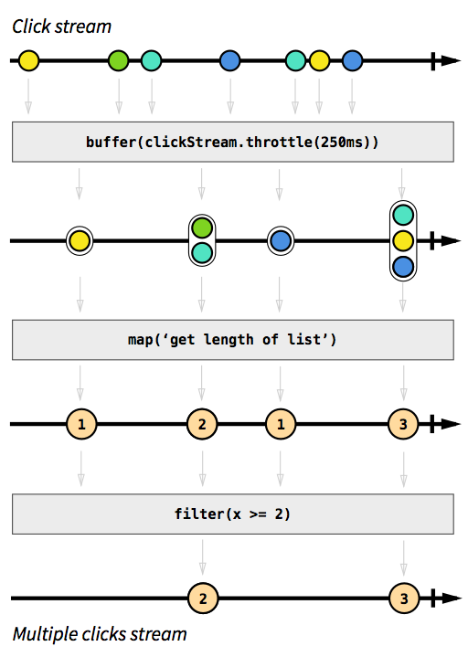

### js

```js
// Make the raw clicks stream
var button = document.querySelector('.this');
var clickStream = Rx.Observable.fromEvent(button, 'click');

// HERE
// The 4 lines of code that make the multi-click logic
var multiClickStream = clickStream
    .buffer(function() { return clickStream.throttle(250); })
    .map(function(list) { return list.length; })
    .filter(function(x) { return x >= 2; });

// Same as above, but detects single clicks
var singleClickStream = clickStream
    .buffer(function() { return clickStream.throttle(250); })
    .map(function(list) { return list.length; })
    .filter(function(x) { return x === 1; });

// Listen to both streams and render the text label accordingly
singleClickStream.subscribe(function (event) {
    document.querySelector('h2').textContent = 'click';
});
multiClickStream.subscribe(function (numclicks) {
    document.querySelector('h2').textContent = ''+numclicks+'x click';
});
Rx.Observable.merge(singleClickStream, multiClickStream)
    .throttle(1000)
    .subscribe(function (suggestion) {
        document.querySelector('h2').textContent = '';
    });


```


### html

```html
<div class="container">
    <div class="header">
         <a href="#" class="this">BUTTON</a><h2>Double click it</h2>
    </div>
</div>
<script src="http://cdnjs.cloudflare.com/ajax/libs/rxjs/2.2.26/rx.js"></script>
<script src="http://cdnjs.cloudflare.com/ajax/libs/rxjs/2.2.26/rx.async.js"></script>
<script src="http://cdnjs.cloudflare.com/ajax/libs/rxjs/2.2.26/rx.coincidence.js"></script>
<script src="http://cdnjs.cloudflare.com/ajax/libs/rxjs/2.2.26/rx.binding.js"></script>
<script src="http://cdnjs.cloudflare.com/ajax/libs/rxjs/2.2.26/rx.time.js"></script>
<script src="http://cdnjs.cloudflare.com/ajax/libs/rxjs-dom/2.0.7/rx.dom.js"></script>
```

### css

```css
body {
    font-family: sans-serif;
    padding: 10px;
}
h2 {
    font-weight: bold;
    display: inline-block;
    margin-left: 20px;
}
.header {
    background: #ECECEC;
    padding: 5px;
}
```

### 示意图

