# 第2讲 传统开发人员学习Javascript指南

tags: 作用域 上下文 对象继承 Javascript

[TOC]


## 为什么要学习Javascript

## 传统开发人员需要针对Javascript转变哪些思维

- 大量使用回调函数

- 原型继承

- 弱类型

- 无IDE支持


## Javascript难点说明

### 布尔表达式

### 作用域

### 上下文

### 对象继承

#### 构造器方式

##### 构造器函数

```js
function Foo(a){
  return this.a = a;
} 
console.log('Foo');
console.log(Foo);

console.log('Foo.prototype')
console.log(Foo.prototype)
```

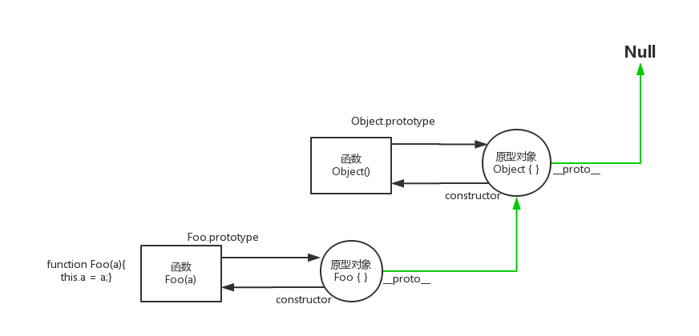

当函数Foo声明，即存在Foo函数对象，和Foo函数的原型对象。
为了方便区分，图例特意用矩形代表函数对象，圆形代表一般对象。

##### 原型对象是如何建立的

```js
var o = new Object();

//可视为等同于  o = {}
```

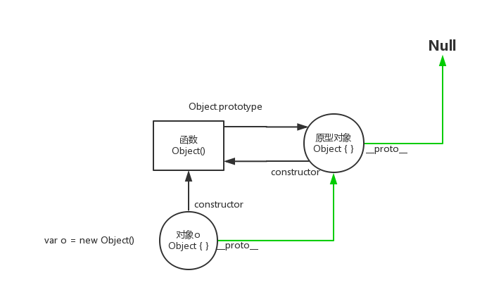

##### 使用构造器函数创建对象

```js
function Foo(a){
  this.a = a;
} 

var foo = new Foo(12);
```


> 小测试

```js
function Foo(a){
  this.a = a;
} 
var foo = new Foo(12);
console.log('1: Foo')
console.log(Foo)

console.log('2: Foo.prototype')
console.log(Foo.prototype)

console.log('3: Foo.constructor')
console.log(Foo.constructor)

console.log('4: Foo.prototype.constructor')
console.log(Foo.prototype.constructor)

console.log('5: Foo.prototype.constructor===Foo')
console.log(Foo.prototype.constructor===Foo)

console.log('6: Foo.prototype.prototype')
console.log(Foo.prototype.prototype)
// 注意为什么是这个结果

console.log('7: Foo.prototype.__proto__')
console.log(Foo.prototype.__proto__)

console.log('8: Foo.prototype.__proto__.__proto__')
console.log(Foo.prototype.__proto__.__proto__)

console.log('9: Foo.prototype.__proto__.constructor')
console.log(Foo.prototype.__proto__.constructor)

console.log('10: Object.prototype')
console.log(Object.prototype)

console.log('11: Foo.prototype.__proto__ === Object.prototype')
console.log(Foo.prototype.__proto__ === Object.prototype)

console.log('12: foo')
console.log(foo)

console.log('13: foo.prototype')
console.log(foo.prototype)
// 注意为什么是这个结果

console.log('14: foo.__proto__')
console.log(foo.__proto__)

console.log('15: foo.__proto__===Foo.prototype')
console.log(foo.__proto__===Foo.prototype)

console.log('16: foo.constructor')
console.log(foo.constructor)

console.log('17: foo.__proto__.constructor')
console.log(foo.__proto__.constructor)

console.log('18: foo.__proto__.constructor===Foo.prototype.constructor')
console.log(foo.__proto__.constructor===Foo.prototype.constructor)

console.log('19: foo.__proto__.constructor===Foo')
console.log(foo.__proto__.constructor===Foo)

console.log('20: foo.__proto__.prototype')
console.log(foo.__proto__.prototype)

console.log('21: foo.__proto__.__proto__')
console.log(foo.__proto__.__proto__)

console.log('22: foo.__proto__.__proto__.__proto__')
console.log(foo.__proto__.__proto__.__proto__)

var o = {}
console.log('23: o.constructor')
console.log(o.constructor)

console.log('24: o.constructor.prototype')
console.log(o.constructor.prototype)

console.log('25: o.constructor === foo.__proto__.__proto__.constructor')
console.log(o.constructor === foo.__proto__.__proto__.constructor)

console.log('26: o.__proto__ === foo.__proto__.__proto__')
console.log(o.__proto__ === foo.__proto__.__proto__)

```
##### 进一步理解New Foo()过程 

- 创建空对象
- 将空对象__proto__属性指向函数的原型对象
- 将空对象的constructor属性指向原型对象的constructor属性（这点要特殊注意，是与当前的原型对象constructor属性一致）
- 将函数的上下文指向创建好的空对象
- return this 是系统自动完成的。（但如果手工return其它对象时，会覆盖系统这一行为）
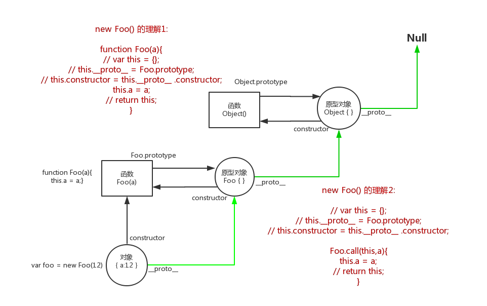

##### 用构造器函数创建多个对象
```js
function Foo(a){
  this.a = a; 
  this.type = 'MYFOO';
  this.add = function(){
    return a+20;
  }
}

var foo = new Foo(12);
var foo2 = new Foo(15);
var foo3 = new Foo(20);

console.log('foo.add')
console.log(foo.add)

console.log('foo2.add')
console.log(foo2.add)

console.log('foo.add === foo2.add')
console.log(foo.add === foo2.add)

```
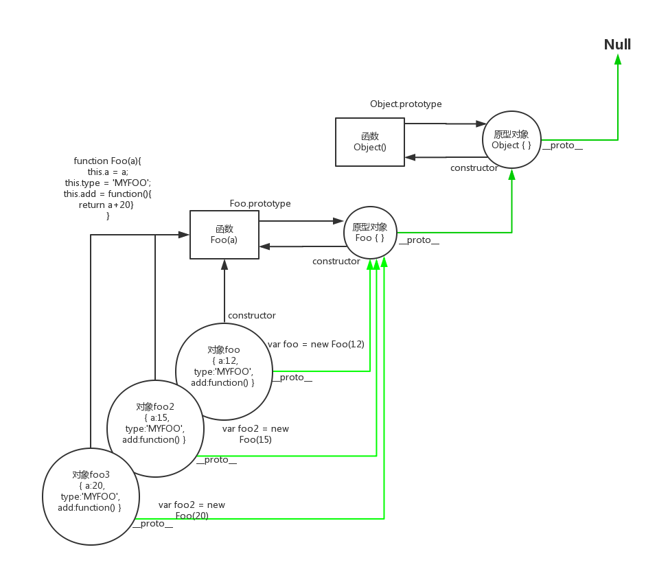

##### 使用原型共用属性和方法
```js
function Foo(a){
  this.a = a; 
}

Foo.prototype.type = 'MYFOO';
Foo.prototype.add = function(){
  return a+20
}

var foo = new Foo(12)
var p;
for (p in foo){
  console.log(p)
}
// a
// type
// add

console.log(Object.getOwnPropertyNames(foo))
// [ "a" ]
 
var foo2 = new Foo(15);
var foo3 = new Foo(20);

console.log('foo.add === foo2.add')
console.log(foo.add === foo2.add)
 
```
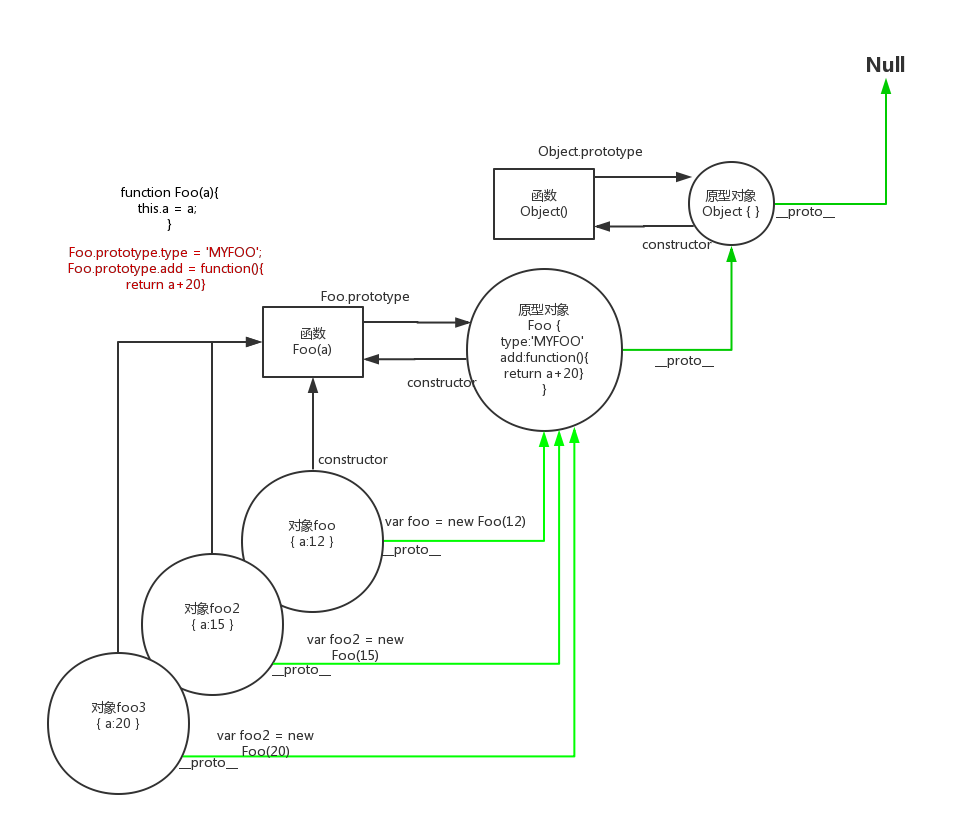

##### 继承之父类函数与子类函数
```js
function Animal(){
　this.species = "动物";
}
function Cat(name,color){
　this.name = name;
　this.color = color;
}
```

js语言本身没有类的概念，构造器函数虽然本意也是为了模拟类。但是如果把函数看成类的话，反而会误导传统开发者按类的思维去思考。

正确的做法是，完全脱离类的概念，仅按原型概念去思考，由子构造器函数创建的对象如何能拥有，与父构造器函数创建的对象同样的属性和方法。

如何实现原型链继承？

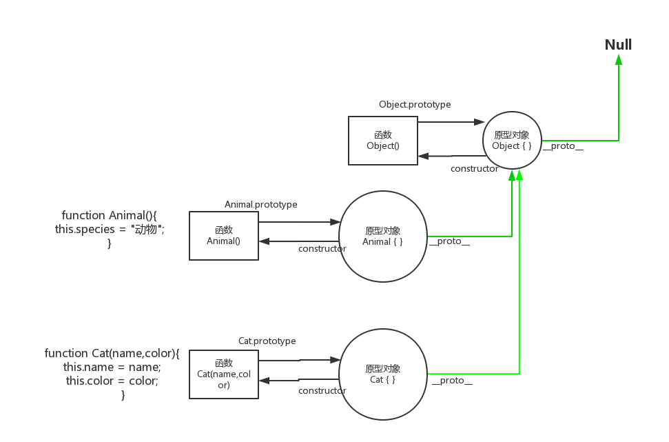

##### prototype继承
```js
function Animal(){
　this.species = "动物";
}
function Cat(name,color){
　this.name = name;
　this.color = color;
}

Cat.prototype = new Animal();
console.log(Cat.prototype)
  //  Animal { species="动物"}
    
var cat1 = new Cat("大毛","黄色");
console.log(cat1.species); // 动物
```
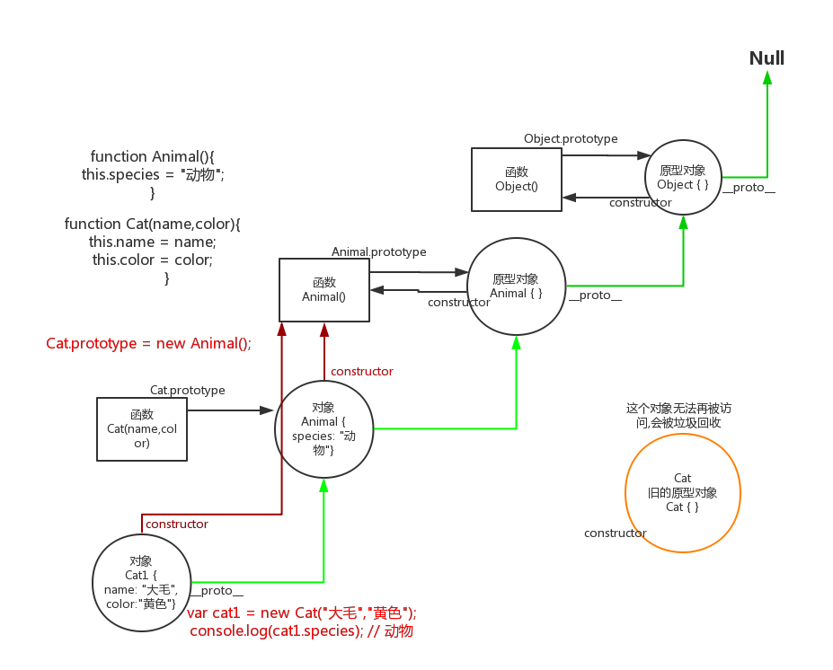

##### prototype继承的改进
```js
function Animal(){
　this.species = "动物";
}
function Cat(name,color){
　this.name = name;
　this.color = color;
}

Cat.prototype = new Animal();
console.log(Cat.prototype)
  //  Animal { species="动物"}

Cat.prototype.constructor = Cat;
var cat1 = new Cat("大毛","黄色");
console.log(cat1.species); // 动物
```

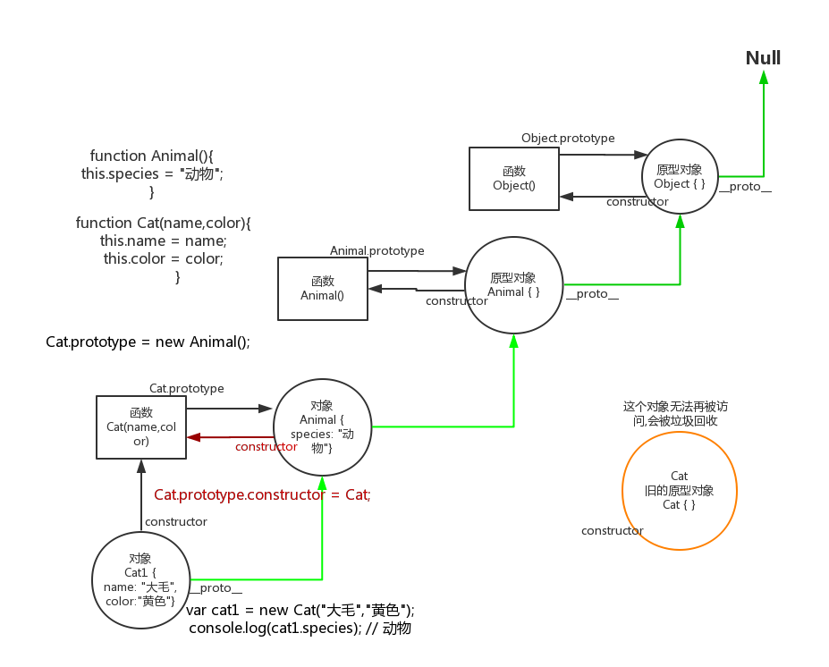

##### prototype直接继承

```js
function Animal(){ }
Animal.prototype.species = "动物";

function Cat(name,color){
　this.name = name;
　this.color = color;
}

Cat.prototype = Animal.prototype;
Cat.prototype.constructor = Cat;

var cat1 = new Cat("大毛","黄色");
console.log(cat1.species); // 动物


```

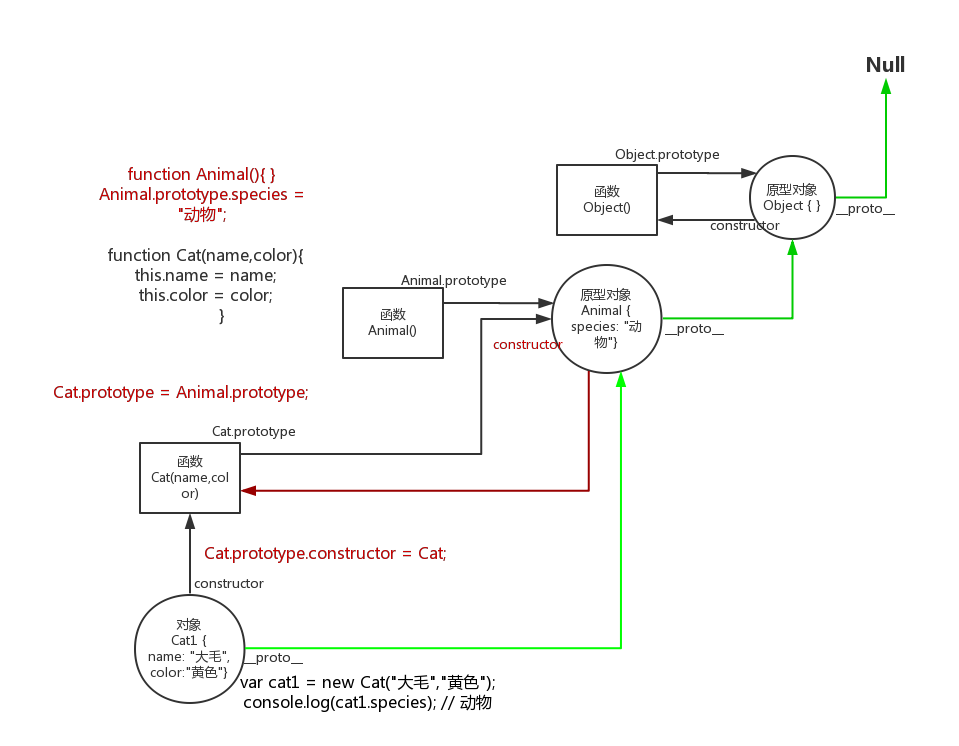

> *注意：* 与前一种方法相比，这样做的优点是效率比较高（不用执行和建立Animal的实例了），比较省内存。缺点是 Cat.prototype和Animal.prototype现在指向了同一个对象，那么任何对Cat.prototype的修改，都会反映到Animal.prototype。
> 
> Cat.prototype.constructor = Cat;
> 
> 这一句实际上把Animal.prototype对象的constructor属性也改掉了！

所以这种方法是不符合继承的要求的。

小测试：

```js
var animal1 = new  Animal();
console.log(animal1);
console.log(animal1.constructor);
```

##### prototype继承使用空对象中介
```js
function Animal(){}

Animal.prototype.species = "动物";

function Cat(name,color){
　this.name = name;
　this.color = color;
}

var F = function(){};
F.prototype = Animal.prototype;

Cat.prototype = new F();
Cat.prototype.constructor = Cat;

var cat1 = new Cat("大毛","黄色");
console.log(cat1.species); // 动物

```

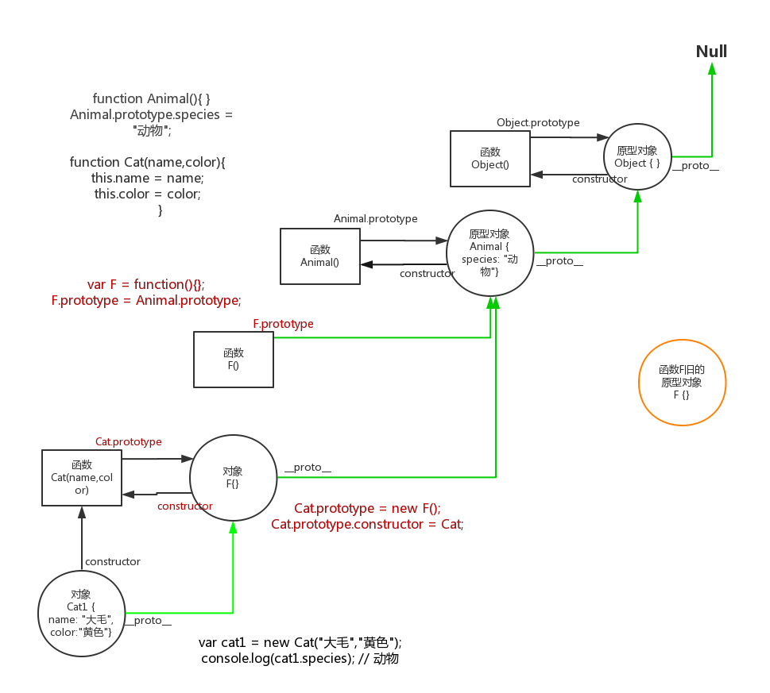

小测试：如果没有这一句：  
~~Cat.prototype.constructor = Cat;~~  
那么 `Cat.prototype.constructor` 会指向哪里？
 
> F是空对象，所以几乎不占内存。这时，修改Cat的prototype对象，就不会影响到Animal的prototype对象。

##### expend函数

extend(fn子类构造函数, fn父类构造函数) 

```js
function extend(Child, Parent){
  var F = function(){};
  F.prototype = Parent.prototype;
  Child.prototype = new F();
  Child.prototype.constructor = Child;
  Child.uber = Parent.prototype;
}
```

使用的时候，方法如下

```js
function Animal(){}
Animal.prototype.species = "动物";
function Cat(name,color){
　this.name = name;
　this.color = color;
}
extend(Cat,Animal);
var cat1 = new Cat("大毛","黄色");
console.log(cat1.species); // 动物
```

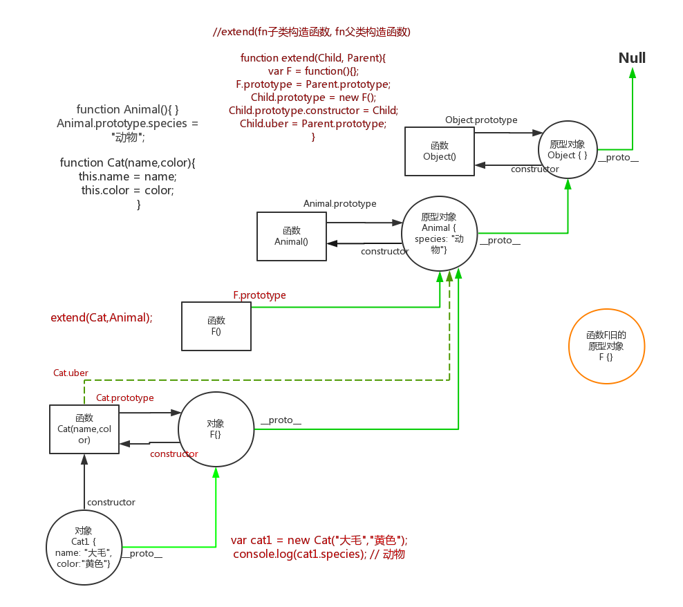

##### 构造器拷贝继承
```js
function Animal(){}
Animal.prototype.species = "动物";

function Cat(name,color){
  this.name = name;
　this.color = color;
}

function extend2(Child, Parent) {
  var p = Parent.prototype;
  var c = Child.prototype;
  for (var i in p) {
    c[i] = p[i];
  }
  c.uber = p;
}

extend2(Cat, Animal);
var cat1 = new Cat("大毛","黄色");
console.log(cat1.species); // 动物
```

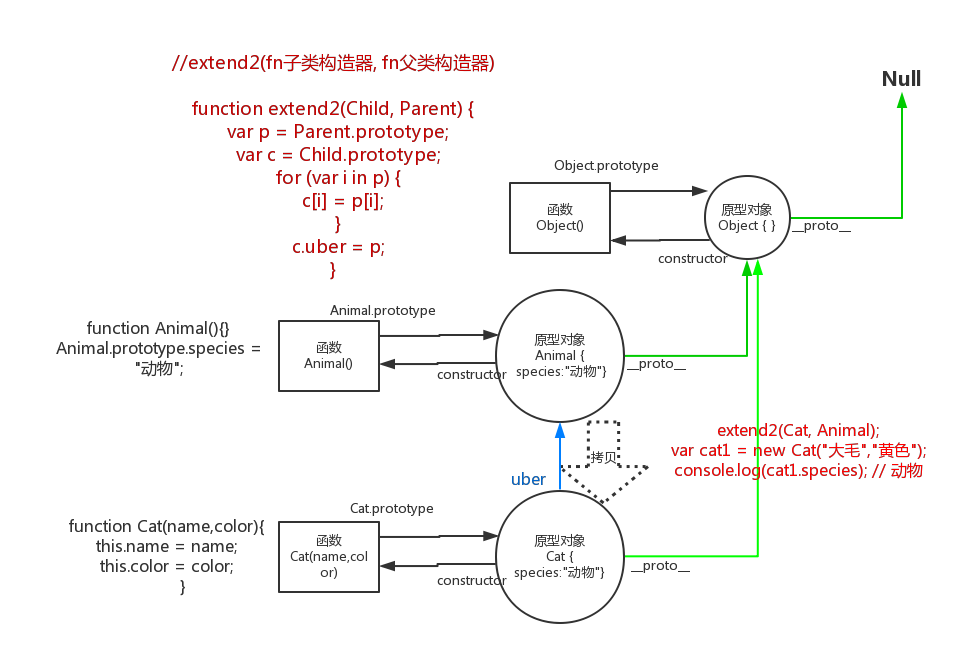

只是浅拷贝，对于对象属性会引用同一个对象，会产生影响

#### 非构造器方式

##### 对象浅拷贝

```js
function extendCopy(p) {
  var c = {};
  for (var i in p) {
    c[i] = p[i];
  }
  c.uber = p;
  return c;
}
var animal = {
  species:"动物",
  array:[1,2,3],
  obj:{a:1,b:2}
}

console.log(animal);

var cat = extendCopy(animal);
cat.name = "CAT";
cat.color = "BLACK";

console.log(cat.species);
console.log(animal.array === cat.array);

cat.array.push(4);

console.log(cat.array);
console.log(animal.array);

cat.obj.b = 10;

console.log(cat.obj.b);
console.log(animal.obj.b);
```
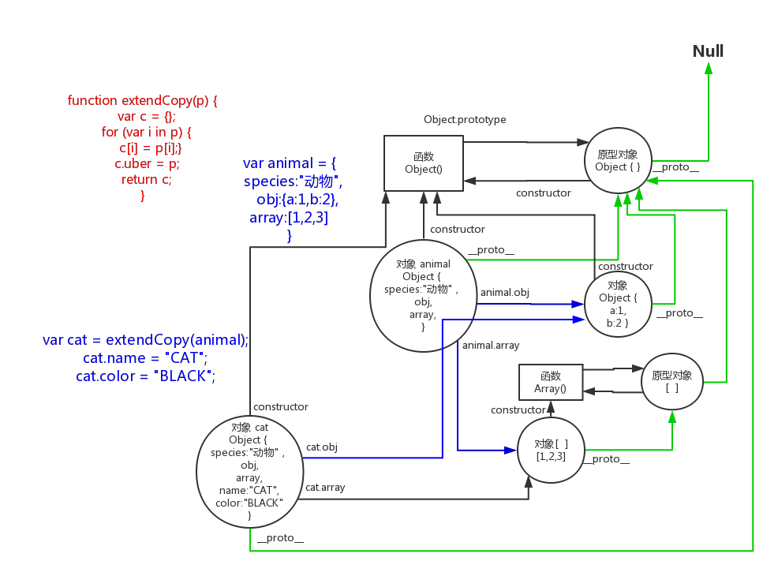

对象浅拷贝方式，并没有形成原型链，并存在对象属性引用问题。

##### 对象深拷贝

```js
function deepCopy(p, c) {
  var c = c || {};
  for (var i in p) {
    if (typeof p[i] === 'object') {
      c[i] = (p[i].constructor === Array) ? [] : {};
      deepCopy(p[i], c[i]);
    } else {
      c[i] = p[i];
    }
  }
  return c;
}

var animal = {
  species:"动物",
  array:[1,2,3],
  obj:{a:1,b:2}
}

console.log(animal);

var cat = deepCopy(animal);
cat.name = "CAT";
cat.color = "BLACK";

console.log(cat.species);
console.log(animal.array === cat.array);

cat.array.push(4);

console.log(cat.array);
console.log(animal.array);

cat.obj.b = 10;

console.log(cat.obj.b);
console.log(animal.obj.b);
```
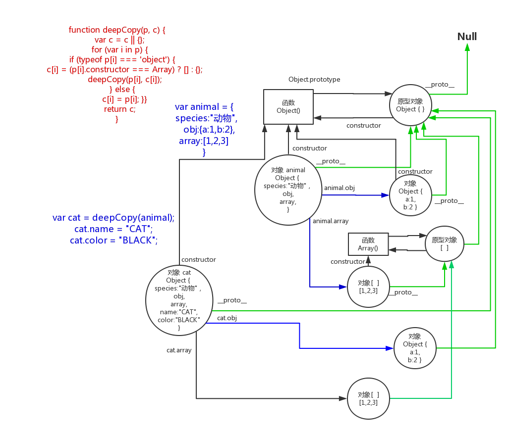

深拷贝解决了对象属性引用问题，但仍然没有形成原型链

> 注意：深拷贝不会拷贝方法，方法属性仍然是引用，因此对方法属性并不会增加消耗
> 因为方法属性 `if (typeof p[i] === 'object')` 条件不成立，方法属性返回 `function`

##### 基于对象的原型继承

```js
var animal = {
  species:"动物"
}

function object(o) {
  function F() {}
  F.prototype = o;
  var n = new F();
  n.uber = o;
  return n;
}
var cat = object(animal);
cat.name = "CAT";
cat.color = "BLACK";
```

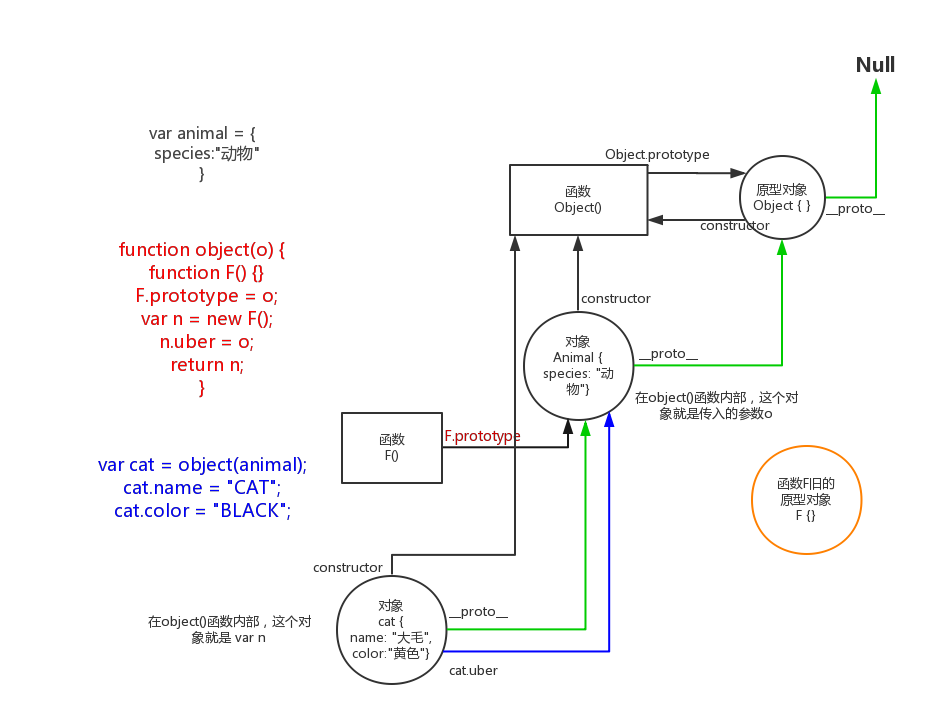
