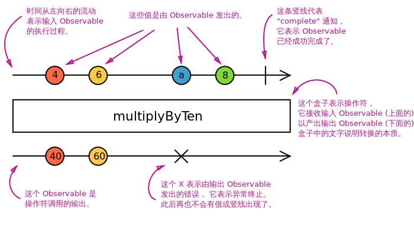

# 第10讲 响应式编程Rxjs

## 资源

[https://buctwbzs.gitbooks.io/rxjs/content/](https://buctwbzs.gitbooks.io/rxjs/content/)

## 概念

### RxJS中解决异步事件管理的基本概念

- Observable可观察对象：表示一个可调用的未来值或者事件的集合。 
- Observer观察者：一个回调函数集合,它知道怎样去监听被Observable发送的值 
- Subscription订阅： 表示一个可观察对象的执行，主要用于取消执行。 
- Operators操作符：纯粹的函数，使得以函数编程的方式处理集合比如: map, filter, contact, flatmap。 
- Subject(主题)：等同于一个事件驱动器，是将一个值或者事件广播到多个观察者的唯一途径。 
- Schedulers(调度者)：用来控制并发，当计算发生的时候允许我们协调，比如 setTimeout, requestAnimationFrame。 


## 本讲项目介绍

### 项目名称


备课项目

`myrx-test`

github 项目地址


分支: E10


### 初始准备

- 新建普通项目
- 引入jquery bootstrap 第三包

```bash
ng new myrx --skip-install

cd myrx

npm install --registry=https://registry.npm.taobao.org --disturl=https://npm.taobao.org/dist --sass-binary-site=http://npm.taobao.org/mirrors/node-sass

ng serve

npm install jquery bootstrap @types/jquery @types/bootstrap --save --registry=https://registry.npm.taobao.org --disturl=https://npm.taobao.org/dist --sass-binary-site=http://npm.taobao.org/mirrors/node-sass

```


`.angular-cli.json`

```
      "styles": [
        "styles.css",
        "../node_modules/bootstrap/dist/css/bootstrap.css"
      ],
      "scripts": [
        "../node_modules/jquery/dist/jquery.js",
        "../node_modules/bootstrap/dist/js/bootstrap.js"
      ],
```

[使用jade的方法.md](使用jade的方法.md)


### 创建组件


`ng g c rxdemo`


### 根组件

`/src/app/app.component.html`

```html
<app-rxdemo></app-rxdemo>
```

###

`/src/app/rxdemo/rxdemo.component.jade`

```jade
h3 例子:统计点击次数
#demo1.alert.alert-success(#demo1='',) 点我

```

```ts
import { Component, OnInit, ViewChild, ElementRef } from '@angular/core';
import * as Rx from 'rxjs/Rx'

@Component({
  selector: 'app-rxdemo',
  templateUrl: './rxdemo.component.html',
  styleUrls: ['./rxdemo.component.css']
})
export class RxdemoComponent implements OnInit {

  @ViewChild('demo1')
  demo1: ElementRef;
  @ViewChild('demo2')
  demo2: ElementRef;
  @ViewChild('demo3')
  demo3: ElementRef;

  constructor() { }

  ngOnInit() {
    Rx.Observable.fromEvent(this.demo1.nativeElement, 'click')
      .scan((acc: number, curr) => {
        return acc + 1;
      }, 0)
      .subscribe(count => console.log(`第 ${count} 次点击(demo1)`));


    Rx.Observable.fromEvent(this.demo2.nativeElement, 'click')
      .throttleTime(1000)
      .mapTo(1)
      .scan(count => count + 1)
      .subscribe(count => console.log(`第 ${count} 次点击(demo2) ${new Date().toTimeString()}`));

    Rx.Observable.fromEvent(this.demo3.nativeElement, 'click')
      .throttleTime(1000)
      .map((event: { clientX }) => event.clientX)
      .scan((acc, clientX) => {
        return { count: acc.count + 1, clientX: clientX }
      }, { count: 0, clientX: null })
      .subscribe(info => console.log(`第 ${info.count} 次点击, x:${info.clientX} (demo3) ${new Date().toTimeString()}`));
  }

}


```

### observable 可观察对象

#### 代码

`ng g c observable`

`/src/app/observable/observable.component.jade`

```jade
h3 例1:
p 一个推送1,2，3,4数值的可观察对象，一旦它被订阅1,2，3,就会被推送，4则会在订阅发生一秒之后被推送，紧接着完成推送
p
  button.btn.btn-default((click)="onRun1()") 执行
  | &nbsp;
  button.btn.btn-default((click)="onRun1Other()") 执行(示例1的另一种写法)

```

`/src/app/observable/observable.component.ts`

```ts
import { Component, OnInit } from '@angular/core';
import * as Rx from 'rxjs/Rx';
import { TeardownLogic } from 'rxjs/Subscription';

@Component({
  selector: 'app-observable',
  templateUrl: './observable.component.html',
  styleUrls: ['./observable.component.css']
})
export class ObservableComponent implements OnInit {

  constructor() { }

  ngOnInit() {
  }

  onRun1() {
    console.log('开始创建 observable - 可观察对象:')
    const observable = Rx.Observable.create(function (observer) {
      observer.next(1);
      observer.next(2);
      observer.next(3);
      setTimeout(() => {
        observer.next(4);
        observer.complete();
      }, 1000);
    });
    console.log('subscribe - 订阅前...');
    observable.subscribe({
      next: x => console.log('当前值: ' + x),
      error: err => console.error('错误: ' + err),
      complete: () => console.log('推送完成.'),
    });
    console.log('subscribe - 订阅后...');
  }

  onRun1Other() {
    console.log('开始创建 observable - 可观察对象:')
    const onSubscription = function (observer: Rx.Observer<number>): TeardownLogic {
      observer.next(1);
      observer.next(2);
      observer.next(3);
      setTimeout(() => {
        observer.next(4);
        observer.complete();
      }, 1000);
    };

    const observable: Rx.Observable<number> = Rx.Observable.create(onSubscription);

    const myobserver: Rx.Observer<number> = {
      next: x => console.log('当前值: ' + x),
      error: err => console.error('错误: ' + err),
      complete: () => console.log('推送完成.'),
    };

    console.log('subscribe - 订阅前...');

     const subscription = observable.subscribe(myobserver);

    console.log('subscribe - 订阅后...');
  }
}


```

结果如下:

```
开始创建 observable - 可观察对象:
observable.component.ts:57 subscribe - 订阅前...
observable.component.ts:52 当前值: 1
observable.component.ts:52 当前值: 2
observable.component.ts:52 当前值: 3
observable.component.ts:61 subscribe - 订阅后...
observable.component.ts:52 当前值: 4
observable.component.ts:54 推送完成.
```


名词与代码的关系:

`可观察对象 Observable (流)`: 表示一组值或事件的集合

>const observable = Rx.Observable.create(onSubscription);

>const observable: Rx.Observable<number> = Rx.Observable.create(onSubscription);


`观察者 Observer`: 一个回调函数集合,监听`Observable`发送的值 

> 
>```
  const myobserver = {
    next: x => console.log('当前值: ' + x), 
    error: err => console.error('错误: ' + err), 
    complete: () => console.log('推送完成.'), 
  }; 
```
>

>
>```
  const myobserver: Rx.Observer<number> = {
    next: x => console.log('当前值: ' + x),
    error: err => console.error('错误: ' + err),
    complete: () => console.log('推送完成.'),
  };
```
>
>

`Subscription订阅`： 表示一个可观察对象的执行，主要用于取消执行。

> const subscription = observable.subscribe(myobserver);

#### Rx.Observable.create 的官方说明

>
create 将 onSubscription 函数转化为一个实际的 Observable 。每当有人订阅该 Observable 的 时候，onSubscription函数会接收 Observer 实例作为唯一参数执行。onSubscription 应该 调用观察者对象的 next, error 和 complete 方法。

>
带值调用 next 会将该值发出给观察者。调用 complete 意味着该 Observable 结束了发出并且不会做任何事情了。 调用 error 意味着出现了错误，传给 error 的参数应该提供详细的错误信息。

>
一个格式良好的 Observable 可以通过 next 方法发出任意多个值，但是 complete 和 error 方法只能被调用 一次，并且调用之后不会再调用任何方法。 如果你试图在 Observable 已经完成或者发生错误之后调用next、 complete 或 error 方法，这些调用将会被忽略，以保护所谓的 Observable 合同。注意，你并不需要一定要在某个时刻 调用 complete 方法，创建一个不会被终止的 Observable 也是完全可以的，一切取决于你的需求。

>
onSubscription 可以选择性的返回一个函数或者一个拥有 unsubscribe 方法的对象。 当要取消对 Observable 的订阅时，函数或者方法将会被调用，清理所有的资源。比如说，如果你在自己的 Observable 里面使用了 setTimeout， 当有人要取消订阅的时候， 你可以清理定时器， 这样就可以减少不必要的触发，并且浏览 器(或者其他宿主环境)也不用将计算能力浪费在这种无人监听的定时事件上。

>
绝大多数情况下你不需要使用 create，因为现有的操作符创建出来的 Observable 能满足绝大多数使用场景。这也就意味着， create 是允许你创建任何 Observable 的底层机制，如果你有非常特殊的需求的话，可以使用它。

### 可观察对象的核心概念

使用Rx.Observable.create或者一个能产生可观察对象的操作符来创造一个可观察对象，
使用一个观察者订阅它，
执行然后给观察者发送next/error/complete通知。
他们的执行可能会被disposed(处理)。


- Creating Observables       创建
- Subscribing to Observables 订阅
- Executing the Observable   执行
- Disposing Observables      处理(清理)

创建(执行)     订阅().清理()

####　官方的代码示例

#####　Creating Observables

Rx.Observable.create 是可观察对象构造函数的别名，
它接受一个参数:onSubscription function。 (参数是一个回调函数)

下面的例子创造一每秒向观察者发射一个字符串"hi"的可观察对象。

```js
var observable = Rx.Observable.create(function onSubscription(observer) {
var id = setInterval(() => {
observer.next('hi')
}, 1000);
});
```

> 可观察对象可以使用create创建，但是通常我们使用被称为creation operators,像of,from,interval等。

onSubscription(订阅)函数是订阅可观察对象最重要的部分。接下来让我们看下订阅的含义是什么。

### Subscribing to Observables 订阅可观察对象

可观察对象可以像下面的例子那样被订阅:

```js
observable.subscribe(x => console.log(x));
```

等同于:

```js
var observer = {
  next: function(x){
    console.log(x)
    }
  }
observable.subscribe(observer);
```

> 当使用observer调用observable.subscribe时，Rx.Observable.create(function onSubscription(observer){}) 中的 onSubscription 函数为既定的 observer 运行。
> 每次调用 observable.subscribe 为给定的观察者触发它自身独立的设定程序。

> 完全不同于诸如addEventListener/removeEventListener事件句柄API.使用observable.subscribe,给定的观察者并没有作为一个监听者被注册。可观察对象甚至也不保存有哪些观察者。

> 订阅是启动可观察对象执行和发送值或者事件给观察者的简单方式。

附加说明:

订阅可以没有处理过程,即:

```
  observable.subscribe();
```

此时Rx会自动隐式创建 `observer` , 

示例代码:

`/src/app/observable/observable.component.ts`

```ts
  onRun2() {
    console.log('开始创建 observable - 可观察对象:')
    const observable = Rx.Observable.create(function (observer) {
      console.log('observer:');
      console.log(observer);
      observer.next(1);
      console.log('1');
      observer.next(2);
      console.log('2');
      observer.next(3);
      console.log('3');
      setTimeout(() => {
        observer.next(4);
        console.log('4');
        observer.complete();
      }, 1000);
    });
    console.log('subscribe - 订阅前...');
    observable.subscribe();
    console.log('subscribe - 订阅后...');
  }
```

`/src/app/observable/observable.component.jade`

```jade
h3 例2:
p 无观察者的订阅
p
  button.btn.btn-default((click)="onRun2()") 执行
```

##### Executing the Observable 执行可观察对象

> 在Observable.create(function(observer){...})中的代码，表示了一个可观察对象的执行，一个仅在观察者订阅的时候发生的惰性计算。执行随着时间产生多个值，以同步或者异步的方式。
下面是可观察对象执行可以发送的三种类型的值

- "Next": 发送一个数字/字符串/对象等值。
- "Error": 发送一个JS错误或者异常。
- "Complete" 不发送值。

> Next通知是最重要且最常见的类型:它们代表发送给观察者的确切数据，Error和Complete通知可能仅在可观察对象执行期间仅发生一次，但仅会执行二者之中的一个。

> 这些约束条件能够在可观察对象语法以类似于正则表达式的方式表达的更清晰:

> next*(error|complete)?

    一个可观察对象的执行期间，零个到无穷多个next通知被发送。如果Error或者Complete通知一旦被发送，此后将不再发送任何值。

> 下面这个例子，可观察对象执行然后发送三个next通知，然后completes:

```js
var observable = Rx.Observable.create(function onSubscription(observer) {
observer.next(1);
observer.next(2);
observer.next(3);
observer.complete();
});

```

> 可观察对象严格的坚守这个契约，所以，下面的代码将不会发送包含数值4的next通知

```js
var observable = Rx.Observable.create(function onSubscription(observer) {
observer.next(1);
observer.next(2);
observer.next(3);
observer.complete();
observer.next(4); 
});

```

> 不失为一个好方式的是，使用try/catch语句包裹通知语句，如果捕获了异常将会发送一个错误通知。

```js
var observable = Rx.Observable.create(function subscribe(observer) {
try {
  observer.next(1);
  observer.next(2);
  observer.next(3);
  observer.complete();
} catch (err) {
  observer.error(err); 
}
});

```

##### Disposing Observables 处理可观察对象的执行(清理资源)

> 由于可观察对象的执行可能是无限的(不停地next)，而对于观察者来说却往往希望在有限的时间内终止执行，因此我们需要一个API来取消执行。因为每一次的执行仅仅服务于一个观察者，一旦观察者听得接收数据，它就不得不通过一个方式去终止执行，从而避免浪费大量的计算性能和内存资源。

> 当observable.subscribe 被调用，观察者将专注于最新被创建的可观察对象的执行，并且这个调用返回一个对象: the subscribe

`var subscription = observable.subscribe(x => console.log(x));`

> the Subscription (订阅) 表示正在进行的执行，这里有一个用于终止执行的小型的API。 使用 subscription.unsubscribe()你可以取消正在进行的执行:

```js
var observable = Rx.Observable.from([10, 20, 30]);
var subscription = observable.subscribe(x => console.log(x));
// Later:
subscription.unsubscribe();
```

> 在你订阅了之后，你将会得到一个 Subscription 对象，它表示正在进行的执行。大胆的去使用 unsubscribe() 去终止执行吧。

>
当我们使用create()创建可观察对象，每一个可观察对象必须确定怎样去处理该执行的资源。你可以通过在subscribe函数内返回的subscription调用unsubscribe函数做到这一点。

> 作为示例，下面是怎样去清除一个serInterval间隔执行


`/src/app/observable/observable.component.ts`

```ts
  onRun3() {
    console.log('开始创建 observable - 可观察对象:')
    const observable = Rx.Observable.create(function (observer) {
      const intervalID = setInterval(() => {
        observer.next('hi');
      }, 1000);

      return function unsubscribe() {
        clearInterval(intervalID);
      };
    });

    console.log('subscribe - 订阅前...');
    const subscription = observable.subscribe(x => console.log('当前值: ' + x));
    console.log('subscribe - 订阅后...');

    console.log('准备5秒后取消订阅...');
    setTimeout(function() {
      console.log('unsubscribe - 取消订阅');
      subscription.unsubscribe();
    }, 5000);

  }
```

`/src/app/observable/observable.component.jade`

```jade
h3 例3:
p 订阅后终止订阅,并清理资源
p
  button.btn.btn-default((click)="onRun3()") 执行
```

### observer 观察者

什么是观察者？

观察者是可观察对象所发送数据的消费者，观察者简单而言是一组回调函数 ， 分别对应一种被可观察对象发送的通知的类型: next, error 和 complete 。

下面是一个典型的观察者对象的例子:

```js
var observer={
next:x=>console.log('Observer got a next value: ' + x),
error: err => console.error('Observer got an error: ' + err),
complete: () => console.log('Observer got a complete notification')
}
```

去使用观察者，需要订阅可观察对象:

`observable.subscribe(observer)`

> 观察者不过是三个回调函数组成的对象，每个回调函数分别对应可观察对象的通知类型。

> RxJS中的观察者是可选的，如果你不提供某个回调函数，可观察对象的执行仍然会照常发生，当然某个类型的通知将不会发生，因为在观察者对象中没有对应于他们的回调函数。

下面的例子中是一个没有complete回调的观察者对象:

```js
var observer={
  next:x=>console.log('Observer got a next value: ' + x),
  error: err => console.error('Observer got an error: ' + err),
}
```

当订阅一个可观察对象，你可能仅仅提供回调来作为参数就够了，并不需要完整的观察者对象，作为示例:

`observable.subscribe(x => console.log('Observer got a next value: ' + x));`

在observable.subscribe内部，它将使用第一个回调参数作为next的处理句柄创建一个观察者对象。也可以通过将三个函数作为参数提供三种回调:

```ts
observable.subscribe(
x => console.log('Observer got a next value: ' + x),
err => console.error('Observer got an error: ' + err),
() => console.log('Observer got a complete notification')
);
```

### Subscription 订阅

什么是订阅？订阅是一个表示一次性资源的对象，通常是一个可观察对象的执行。订阅对象有一个重要的方法:unsubscribe，该方法不需要参数，仅仅去废弃掉可观察对象所持有的资源。在以往的RxJS的版本中，"Subscription订阅"被称为"Disposable"。

```js
var observable = Rx.Observable.interval(1000);
var subscription = observable.subscribe(x => console.log(x));
// Later:
// This cancels the ongoing Observable execution which
// was started by calling subscribe with an Observer.
subscription.unsubscribe();
```

附加说明:

什么情况下需要 `unsubscribe`,一般为以下两种情况

- observable 是无限循环或永远等待事件触发,即在无法预计何时可以 `complete` 时
- 需要提前结束 `subscribe` 时


### Subject (主题)


>什么是 Subject？ - RxJS Subject 是一种特殊类型的 Observable ，
它允许将值多播给多个观察者，所以 Subject 是多播的，
而普通的 Observables 是单播的 (每个已订阅的观察者都拥有 Observable 的独立执行)。

`每个 Subject 都是 Observable 可观察对象`

对于 Subject，你可以提供一个观察者并使用 subscribe 方法，就可以开始正常接收值。
从观察者的角度而言，它无法判断 Observable 执行是来自普通的 Observable 还是 Subject 。

在 Subject 的内部，subscribe 不会调用发送值的新执行。
它只是将给定的观察者注册到观察者列表中，类似于其他库或语言中的 addListener 的工作方式。

`每个 Subject 都是观察者`

Subject 是一个有如下方法的对象： next(v)、error(e) 和 complete() 。
要给 Subjetc 提供新值，只要调用 next(theValue)，
它会将值多播给已注册监听该 Subject 的观察者们。

#### 示例代码:

`ng g c subject`

`/src/app/app.module.ts`

```ts
const routes: Routes = [
  {
    path: 'rxdemo',
    component: RxdemoComponent,
  },
  {
    path: '',
    redirectTo: '/rxdemo',
    pathMatch: 'full'
  },
  {
    path: 'observable',
    component: ObservableComponent
  },
  {
    path: 'subject',
    component: SubjectComponent
  }
];
```

`/src/app/app.component.jade`

```jade
.container
  p
    a([routerLink]="['/rxdemo']") 简单示例
    | &nbsp;
    a([routerLink]="['/observable']") observable
    | &nbsp;
    a([routerLink]="['/subject']") subject
  router-outlet
```

`/src/app/subject/subject.component.jade`

```jade
h3 例1:
p 简单Subject 与 Observable 的对比
p
  button.btn.btn-default((click)="onRun1()") 执行
  | &nbsp;
  button.btn.btn-default((click)="onRun1Diff()") 执行Observable
```

`/src/app/subject/subject.component.ts`

```ts
import { Component, OnInit } from '@angular/core';
import * as Rx from 'rxjs/Rx';

@Component({
  selector: 'app-subject',
  templateUrl: './subject.component.html',
  styleUrls: ['./subject.component.css']
})
export class SubjectComponent implements OnInit {

  constructor() { }

  ngOnInit() {
  }

  onRun1() {
    console.log('----------------------');
    const subject = new Rx.Subject();

    console.log('开始订阅A...')
    subject.subscribe({
      next: (v) => console.log('观察A: ' + v)
    });

    console.log('开始订阅B...')
    subject.subscribe({
      next: (v) => console.log('观察B: ' + v)
    });

    console.log('开始发射值:1');
    subject.next(1);
    console.log('开始发射值:2')
    subject.next(2);

    console.log('----------------------');
  }
  onRun1Diff() {
    console.log('======================');
    const observable = Rx.Observable.create(function (observer) {
      console.log('开始发射值:1');
      observer.next(1);
      console.log('开始发射值:2')
      observer.next(2);
      observer.complete();
    });

    console.log('开始订阅A...')
    observable.subscribe({
      next: (v) => console.log('观察A: ' + v)
    });

    console.log('开始订阅B...')
    observable.subscribe({
      next: (v) => console.log('观察B: ' + v)
    });

    console.log('======================');
  }
}

```

结果如下:

```
----------------------
subject.component.ts:20 开始订阅A...
subject.component.ts:25 开始订阅B...
subject.component.ts:30 开始发射值:1
subject.component.ts:22 观察A: 1
subject.component.ts:27 观察B: 1
subject.component.ts:32 开始发射值:2
subject.component.ts:22 观察A: 2
subject.component.ts:27 观察B: 2
subject.component.ts:35 ----------------------
```

```
======================
subject.component.ts:47 开始订阅A...
subject.component.ts:40 开始发射值:1
subject.component.ts:49 观察A: 1
subject.component.ts:42 开始发射值:2
subject.component.ts:49 观察A: 2
subject.component.ts:52 开始订阅B...
subject.component.ts:40 开始发射值:1
subject.component.ts:54 观察B: 1
subject.component.ts:42 开始发射值:2
subject.component.ts:54 观察B: 2
subject.component.ts:57 ======================
```

#### 通过 Subject 将单播的 Observable 执行转换为多播

因为 Subject 是观察者，这也就在意味着你可以把 Subject 作为参数传给任何 Observable 的 subscribe 方法

通过 Subject 将单播的 Observable 执行转换为多播的。

这也说明了 Subjects 是将任意 Observable 执行共享给多个观察者的唯一方式。

示例代码:

`/src/app/observable/observable.component.jade`

```jade
h3 例2:
p 通过 Subject 将单播的 Observable 执行转换为多播
p
  button.btn.btn-default((click)="onRun2()") 执行
```

`/src/app/subject/subject.component.ts`

```ts
  onRun2() {
    const subject = new Rx.Subject();
    console.log('开始订阅A...')
    subject.subscribe({
      next: (v) => console.log('观察A: ' + v)
    });
    console.log('开始订阅B...')
    subject.subscribe({
      next: (v) => console.log('观察B: ' + v)
    });

    const observable = Rx.Observable.create(function (observer) {
      console.log('开始发射值:1');
      observer.next(1);
      console.log('开始发射值:2')
      observer.next(2);
      observer.complete();
    });

    console.log('subject 开始订阅 observable ...')
    observable.subscribe(subject);
  }
```

### Operators 操作符

尽管 RxJS 的根基是 Observable，但最有用的还是它的操作符。
操作符是允许复杂的异步代码以声明式的方式进行轻松组合的基础代码单元。

`什么是操作符？`

```
操作符是 Observable 类型上的方法，比如 .map(...)、.filter(...)、.merge(...)，等等。

当操作符被调用时，它们不会改变已经存在的 Observable 实例。

相反，它们返回一个新的 Observable ，它的 subscription 逻辑基于第一个 Observable 。
```

>
操作符是函数，它基于当前的 Observable 创建一个新的 Observable。
这是一个无副作用的操作：前面的 Observable 保持不变。

操作符本质上是一个纯函数 (pure function)，它接收一个 Observable 作为输入，
并生成一个新的 Observable 作为输出。
订阅输出 Observalbe 同样会订阅输入 Observable 。


创建一个自定义操作符函数，它将从输入 Observable 接收的每个值都乘以10

#### 示例代码:

`ng g c subject`

`/src/app/app.module.ts`

```ts
const routes: Routes = [
  {
    path: 'rxdemo',
    component: RxdemoComponent,
  },
  {
    path: '',
    redirectTo: '/rxdemo',
    pathMatch: 'full'
  },
  {
    path: 'observable',
    component: ObservableComponent
  },
  {
    path: 'subject',
    component: SubjectComponent
  },
  {
    path: 'operators',
    component: OperatorsComponent

  }
];
```

`/src/app/app.component.jade`

```jade
.container
  p
    a([routerLink]="['/rxdemo']") 简单示例
    | &nbsp;
    a([routerLink]="['/observable']") observable
    | &nbsp;
    a([routerLink]="['/subject']") subject
    | &nbsp;
    a([routerLink]="['/operators']") operators
  router-outlet
```

`/src/app/operators/operators.component.jade`

```jade
h3 例1:
p 自定义操作符:创建一个自定义操作符函数，它将从输入 Observable 接收的每个值都乘以10
p
  button.btn.btn-default((click)="onRun1()") 执行
```

`/src/app/operators/operators.component.ts`

```ts
import { Component, OnInit } from '@angular/core';
import * as Rx from 'rxjs/Rx';

@Component({
  selector: 'app-operators',
  templateUrl: './operators.component.html',
  styleUrls: ['./operators.component.css']
})
export class OperatorsComponent implements OnInit {

  constructor() { }

  ngOnInit() {
  }
  onRun1() {
    const multiplyByTen = function (input) {
      const output = Rx.Observable.create(function (observer) {
        input.subscribe({
          next: (v) => observer.next(10 * v),
          error: (err) => observer.error(err),
          complete: () => observer.complete()
        });
      });
      return output;
    }

    const input = Rx.Observable.create(function (observer) {
      observer.next(1);
      observer.next(2);
      observer.next(3);
      setTimeout(() => {
        observer.next(4);
        observer.complete();
      }, 1000);
    });
    const output = multiplyByTen(input);
    output.subscribe(x => console.log(x));
  }
}

```

### Marble diagrams 弹珠图

要解释操作符是如何工作的，文字描述通常是不足以描述清楚的。 

许多操作符都是跟时间相关的，它们可能会以不同的方式延迟(delay)、取样(sample)、节流(throttle)或去抖动值(debonce)。

图表通常是更适合的工具。

弹珠图是操作符运行方式的视觉表示，
其中包含输入 Obserable(s) (输入可能是多个 Observable )、
操作符及其参数和输出 Observable 

> 在弹珠图中，时间流向右边，图描述了在 Observable 执行中值(“弹珠”)是如何发出的。

在下图中可以看到解剖过的弹珠图。



### 操作符链式示例

`/src/app/operators/operators.component.jade`

```jade
h3 例2:
p  操作符链式示例 .from.filter.map.
p
  button.btn.btn-default((click)="onRun2()") 执行
```

`/src/app/operators/operators.component.ts`

```ts
  onRun2() {
    Rx.Observable.from([1, 2, 3, 4])
      .filter(value => value % 2 === 0)
      .map(value => value * value)
      .subscribe(
      value => console.log(value),
      error => console.error(error),
      () => console.log('已结束.')
      );
  }
```

#### from 

从一个数组、类数组对象、Promise、迭代器对象或者类 Observable 对象创建一个 Observable.

[http://cn.rx.js.org/class/es6/Observable.js~Observable.html#static-method-fromPromise](http://cn.rx.js.org/class/es6/Observable.js~Observable.html#static-method-fromPromise)

#### filter 过滤

通过只发送源 Observable 的中满足指定 predicate 函数的项来进行过滤。

[http://cn.rx.js.org/class/es6/Observable.js~Observable.html#instance-method-filter](http://cn.rx.js.org/class/es6/Observable.js~Observable.html#instance-method-filter)

#### map 映射

将给定的 project 函数应用于源 Observable 发出的每个值，并将结果值作为 Observable 发出。

[http://cn.rx.js.org/class/es6/Observable.js~Observable.html#instance-method-map](http://cn.rx.js.org/class/es6/Observable.js~Observable.html#instance-method-map)

### 事件监听示例

`/src/app/operators/operators.component.jade`

```jade
h3 例3:
p 事件监听常用操作符
p 普通编辑框,原始事件:
  input(#input1='',(input)="onInputByInput1(input1.value)")
p 普通编辑框,Rx监听事件:
  input(#input2='')
```

`/src/app/operators/operators.component.ts`

```ts
  @ViewChild('input2')
  input2: ElementRef;

  ngOnInit() {
    this.input2sub();
  }

  onInputByInput1(value) {
    console.log('搜索:' + value);
  }

  input2sub() {
    Rx.Observable.fromEvent(this.input2.nativeElement, 'input')
      .debounceTime(500)
      .subscribe(() => console.log('搜索:' + this.input2.nativeElement.value))
  }


```

使用模块本地变量,是为了事件处理过程不依赖 $event对象,否则要这样处理

```html
<input type="text" (keyup)="onKey($event)">
```

```
  onKey(event: any) {
    console.log(event.target.value);
  }
```


#### debounceTime (防抖动)

只有在特定的一段时间经过后并且没有发出另一个源值，才从源 Observable 中发出一个值。

[http://cn.rx.js.org/class/es6/Observable.js~Observable.html#instance-method-debounceTime](http://cn.rx.js.org/class/es6/Observable.js~Observable.html#instance-method-debounceTime)

#### 使用 angular 响应式表单模块

`/src/app/app.module.ts`

```ts

@NgModule({
  declarations: [
    AppComponent,
    RxdemoComponent,
    ObservableComponent,
    SubjectComponent,
    OperatorsComponent
  ],
  imports: [
    BrowserModule,
    RouterModule.forRoot(routes),
    ReactiveFormsModule
  ],
  providers: [],
  bootstrap: [AppComponent]
})
```

`/src/app/operators/operators.component.ts`

```ts
import { Component, OnInit, ViewChild, ElementRef } from '@angular/core';
import * as Rx from 'rxjs/Rx';
import { FormControl } from '@angular/forms';

@Component({
  selector: 'app-operators',
  templateUrl: './operators.component.html',
  styleUrls: ['./operators.component.css']
})
export class OperatorsComponent implements OnInit {


  @ViewChild('input2')
  input2: ElementRef;

  input3: FormControl = new FormControl();

  constructor() { }

  ngOnInit() {
    this.input2sub();
    this.input3sub();
  }
  onRun1() {
    const multiplyByTen = function (input) {
      const output = Rx.Observable.create(function (observer) {
        input.subscribe({
          next: (v) => observer.next(10 * v),
          error: (err) => observer.error(err),
          complete: () => observer.complete()
        });
      });
      return output;
    }

    const input = Rx.Observable.create(function (observer) {
      observer.next(1);
      observer.next(2);
      observer.next(3);
      setTimeout(() => {
        observer.next(4);
        observer.complete();
      }, 1000);
    });
    const output = multiplyByTen(input);
    output.subscribe(x => console.log(x));
  }
  onRun2() {
    Rx.Observable.from([1, 2, 3, 4])
      .filter(value => value % 2 === 0)
      .map(value => value * value)
      .subscribe(
      value => console.log(value),
      error => console.error(error),
      () => console.log('已结束.')
      );
  }
  onInputByInput1(value) {
    console.log('搜索:' + value);
  }

  input2sub() {
    Rx.Observable.fromEvent(this.input2.nativeElement, 'input')
      .debounceTime(500)
      .subscribe(() => console.log('搜索:' + this.input2.nativeElement.value))
  }

  input3sub() {
    this.input3.valueChanges
      .debounceTime(500)
      .subscribe(value => console.log('搜索:' + value));
  }
}

```

`/src/app/operators/operators.component.jade`

```jade
h3 例1:
p 自定义操作符:创建一个自定义操作符函数，它将从输入 Observable 接收的每个值都乘以10
p
  button.btn.btn-default((click)="onRun1()") 执行
hr
h3 例2:
p  操作符链式示例 .from.filter.map.
p
  button.btn.btn-default((click)="onRun2()") 执行
hr
h3 例3:
p 事件监听常用操作符
p 普通编辑框,原始事件:
  input(#input1='',(input)="onInputByInput1(input1.value)")
p 普通编辑框,Rx监听事件:
  input(#input2='')
p angular编辑框,angular响应式监听事件:
  input([formControl]="input3")
```

- `formControl` 是angular的指令,表示将`input`的formControl绑定到组件的`input3`对象
- 绑定后,当`input`的值发生改变时, `searchInput`对象将发送事件流