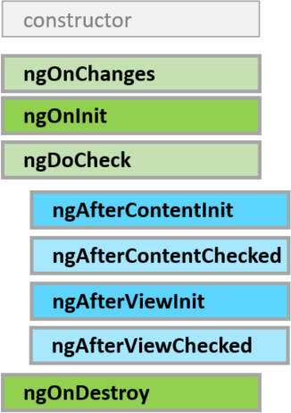

# 第14讲 组件生命周期

## 组件生命周期钩子



### 组件初始化

- constructor
- ngOnChanges
- ngOnInit
- ngDoCheck
- ngAfterContentInit
- ngAfterContentChecked
- ngAfterViewInit
- ngAfterViewChecked

### 变更检测

- ngOnChanges
- ngDoCheck
- ngAfterContentChecked
- ngAfterViewChecked

### 组件销毁

- ngOnDestroy


## 生命周期的顺序

[https://angular.cn/docs/ts/latest/guide/lifecycle-hooks.html#!#hooks-purpose-timing](https://angular.cn/docs/ts/latest/guide/lifecycle-hooks.html#!#hooks-purpose-timing)

## 本讲项目介绍

### 项目名称

`mycomponent`

github 项目地址


备课项目

`mycomponent-test`

github 项目地址


分支: E14


## 创建通讯演示组件及设置路由

`ng g c mainLifeDemo`

`/src/app/app-routing.module.ts`

```ts
import { NgModule } from '@angular/core';
import { Routes, RouterModule } from '@angular/router';
import { MainMessageDemoComponent } from './main-message-demo/main-message-demo.component';
import { MainLifeDemoComponent } from './main-life-demo/main-life-demo.component';

const routes: Routes = [
  {
    path: '',
    redirectTo: 'message',
    pathMatch: 'full'
  },
  {
    path: 'message',
    component: MainMessageDemoComponent
  },
  {
    path: 'life',
    component: MainLifeDemoComponent,
  }
];

@NgModule({
  imports: [RouterModule.forRoot(routes)],
  exports: [RouterModule]
})
export class AppRoutingModule { }

```

`/src/app/app.component.jade`

```jade
.container
  h2 组件项目
  div
    a([routerLink]="['message']") 组件通讯演示
    | &nbsp;
    a([routerLink]="['life']") 生命周期演示   
  hr
  router-outlet
```


## 完整生命周期

### 创建父子组件

`ng g c lifecycleDemoChild`
`ng g c lifecycleDemoParent`

`/src/app/lifecycle-demo-child/lifecycle-demo-child.component.jade`

```jade
.panel.panel-info
  .panel-heading
    h3.panel-title 我是子组件:LifecycleDemoChildComponent
  .panel-body
    h3
      span.label.label-info {{value}}
```

`/src/app/lifecycle-demo-child/lifecycle-demo-child.component.ts`

```ts
import {
  Component, OnInit, Input, OnChanges, DoCheck,
  AfterContentInit, AfterContentChecked, AfterViewInit,
  AfterViewChecked, OnDestroy, SimpleChanges
} from '@angular/core';

let nextId = 1;

@Component({
  selector: 'app-lifecycle-demo-child',
  templateUrl: './lifecycle-demo-child.component.html',
  styleUrls: ['./lifecycle-demo-child.component.css']
})
export class LifecycleDemoChildComponent implements OnInit, OnChanges, DoCheck,
  AfterContentInit, AfterContentChecked,
  AfterViewInit, AfterViewChecked,
  OnDestroy {
  @Input()
  value: number;

  logIt(msg: string) {
    console.log(`#${nextId++} ${msg}`);
  }
  constructor() {
    this.logIt('constructor: value 属性在 constructor 里的值是:' + this.value);
  }

  ngOnInit() {
    this.logIt('ngOnInit: value 属性在 ngOnInit 里的值是:' + this.value);
  }

  ngOnDestroy(): void {
    this.logIt('ngOnDestroy');
  }
  ngAfterViewChecked(): void {
    this.logIt('ngAfterViewChecked');
  }
  ngAfterViewInit(): void {
    this.logIt('ngAfterViewInit');
  }
  ngAfterContentChecked(): void {
    this.logIt('ngAfterContentChecked');
  }
  ngAfterContentInit(): void {
    this.logIt('ngAfterContentInit');
  }
  ngDoCheck(): void {
    this.logIt('ngDoCheck');
  }
  ngOnChanges(changes: SimpleChanges): void {
    // tslint:disable-next-line:max-line-length
    this.logIt(`ngOnChanges: this.value: ${this.value}, currentValue: ${changes['value'].currentValue}, previousValue:${changes['value'].previousValue}`)
  }

}
```

`/src/app/lifecycle-demo-parent/lifecycle-demo-parent.component.jade`

```jade
.panel.panel-success
  .panel-heading
    h3.panel-title 生命周期演示
  .panel-body
    div
      button.btn.btn-success(type="button",[hidden]="hasChild",(click)="createChild()") 创建组件
      | &nbsp;
      button.btn.btn-danger(type="button",[hidden]="!hasChild",(click)="delChild()") 销毁组件
      | &nbsp;
      button.btn.btn-primary(type="button",[hidden]="!hasChild",(click)="updateChildValue()") 更新属性
    hr
    app-lifecycle-demo-child([value]="childValue",*ngIf="hasChild")

```

`/src/app/lifecycle-demo-parent/lifecycle-demo-parent.component.ts`

```ts
import { Component, OnInit } from '@angular/core';

@Component({
  selector: 'app-lifecycle-demo-parent',
  templateUrl: './lifecycle-demo-parent.component.html',
  styleUrls: ['./lifecycle-demo-parent.component.css']
})
export class LifecycleDemoParentComponent implements OnInit {

  hasChild = false;
  childValue: number;
  constructor() { }

  ngOnInit() {
  }

  createChild() {
    this.updateChildValue();
    this.hasChild = true;
  }
  delChild() {
    this.hasChild = false;
  }
  updateChildValue() {
    this.childValue = parseFloat((Math.random() * 100 + 1).toFixed(2));
  }
}

```

`/src/app/main-life-demo/main-life-demo.component.jade`

```jade
h3 演示组件中所有可能存在的钩子。
app-lifecycle-demo-parent
hr
```

执行结果:

```
#1 constructor: value 属性在 constructor 里的值是:undefined
#2 ngOnChanges: this.value: 99.6, currentValue: 99.6, previousValue:undefined
#3 ngOnInit: value 属性在 ngOnInit 里的值是:99.6
#4 ngDoCheck
#5 ngAfterContentInit
#6 ngAfterContentChecked
#7 ngAfterViewInit
#8 ngAfterViewChecked
#9 ngOnChanges: this.value: 17.02, currentValue: 17.02, previousValue:99.6
#10 ngDoCheck
#11 ngAfterContentChecked
#12 ngAfterViewChecked
#13 ngOnDestroy
```


#### 说明

- `ngOnChanges`

只有在输入属性变更时,该钩子才会被执行
并会在组件创建后首先执行一次
即对组件进行属性绑定时,如 `[value]="childValue"`
在`constructor` 阶段还没有处理 `[value]`
在`constructor`执行后,才会处理 `[value]="childValue"`

```ts
  ngOnChanges(changes: SimpleChanges): void {
    // tslint:disable-next-line:max-line-length
    this.logIt(`ngOnChanges: this.value: ${this.value}, currentValue: ${changes['value'].currentValue}, previousValue:${changes['value'].previousValue}`)
  }
```

`ngOnChanges` 在  `constructor` 之后, `ngOnInit` 之前会被执行一次

如果以后, 输入属性又有变化, 则 `ngOnChanges` 会再次执行, 但`ngOnInit`不会执行


- `ngOnInit`

使用ngOnInit()有两个原因：

>
在构造函数之后马上执行复杂的初始化逻辑
>
在Angular设置完输入属性之后，对该组件进行准备。

`不要在组件的构造函数中获取数据`

构造函数中除了使用简单的值对局部变量进行初始化之外，什么都不应该做。

`ngOnInit()是组件获取初始数据的好地方`

另外还要记住，在指令的构造函数完成之前，那些被绑定的输入属性还都没有值。 如果我们需要基于这些属性的值来初始化这个指令，这种情况就会出问题。 而当ngOnInit()执行的时候，这些属性都已经被正确的赋值过了。

> 我们访问这些属性的第一次机会，实际上是ngOnChanges()方法，Angular会在ngOnInit()之前调用它。 但是在那之后，Angular还会调用ngOnChanges()很多次。而ngOnInit()只会被调用一次。
>

你可以信任Angular会在创建组件后立刻调用ngOnInit()方法。 这里是放置复杂初始化逻辑的好地方。

- `ngOnDestroy`

一些清理逻辑必须在Angular销毁指令之前运行，把它们放在ngOnDestroy()中。

这是在该组件消失之前，可用来通知应用程序中其它部分的最后一个时间点。

这里是用来释放那些不会被垃圾收集器自动回收的各类资源的地方。 取消那些对可观察对象和DOM事件的订阅。停止定时器。注销该指令曾注册到全局服务或应用级服务中的各种回调函数。 如果不这么做，就会有导致内存泄露的风险。


## ngOnChanges示例

### 创建父子组件

`ng g c hookOnChangesDemoChild`
`ng g c hookOnChangesDemoParent`


`/src/app/hook-on-changes-demo-child/hook-on-changes-demo-child.component.jade`

```jade
.panel.panel-info
  .panel-heading
    h3.panel-title 我是子组件:HookOnChangesDemoChildComponent
  .panel-body
    div
      | 父组件传来的输入属性(quantity):
      input(type="number",placeholder="请输入数量",[(ngModel)]="quantity")
    div 用户姓名: {{user.name}}
    div
      | 自身属性(price):
      input(type="number",placeholder="请输入价格",[(ngModel)]="price")
```

`/src/app/hook-on-changes-demo-child/hook-on-changes-demo-child.component.ts`


```ts
import { Component, OnInit, Input, OnChanges, SimpleChanges } from '@angular/core';

@Component({
  selector: 'app-hook-on-changes-demo-child',
  templateUrl: './hook-on-changes-demo-child.component.html',
  styleUrls: ['./hook-on-changes-demo-child.component.css']
})
export class HookOnChangesDemoChildComponent implements OnInit, OnChanges {

  @Input()
  quantity: number;
  @Input()
  user: { name };

  price = 999;

  constructor() {
    console.log('constructor...');
  }

  ngOnInit() {
    console.log('ngOnInit...');
  }

  ngOnChanges(changes: SimpleChanges): void {
    console.log('ngOnChanges...');
    console.log(JSON.stringify(changes, null, 2));
  }
}

```

`/src/app/hook-on-changes-demo-parent/hook-on-changes-demo-parent.component.jade`

```jade
.panel.panel-success
  .panel-heading
    h3.panel-title 我是父组件:HookOnChangesDemoParentComponent
  .panel-body
    div
      | 简单值(quantity):
      input(type="number",placeholder="请输入数量",[(ngModel)]="quantity")
    div
      | 对象属性(user.name):
      input(type="text",placeholder="请输入用户姓名",[(ngModel)]="user.name")
    hr
    app-hook-on-changes-demo-child([user]="user",[quantity]="quantity")

```

`/src/app/hook-on-changes-demo-parent/hook-on-changes-demo-parent.component.ts`

```ts
import { Component, OnInit } from '@angular/core';

@Component({
  selector: 'app-hook-on-changes-demo-parent',
  templateUrl: './hook-on-changes-demo-parent.component.html',
  styleUrls: ['./hook-on-changes-demo-parent.component.css']
})
export class HookOnChangesDemoParentComponent implements OnInit {
  quantity = 100;
  user = {
    name: ''
  };
  constructor() { }

  ngOnInit() {
  }

}

```


`/src/app/main-life-demo/main-life-demo.component.jade`

```jade
h3 演示组件中所有可能存在的钩子
app-lifecycle-demo-parent
hr
h3 ngOnChanges示例
app-hook-on-changes-demo-parent
hr
```


说明:


- `ngOnChanges` 是当输入属性本身被改变时,且改变是由父组件引起时,才会触发
- 如果输入属性是对象,仅对象的属性值变化,不会触发,这个对象的引用没有发生变化，于是从Angular的视角看来，也就没有什么需要报告的变化了。
- 如果输入属性是对象,要对象与上一个对象不是同一个对象时,才会触发
- 虽然不会触发,但属性值的变更是可以被捕捉到的
- `SimpleChanges`包含所有有改变的输入属性
- 组件非输入属性值改变,不会触发

输出结果:

初始化时

```js
{
  "quantity": {
    "currentValue": 100,
    "firstChange": true
  },
  "user": {
    "currentValue": {
      "name": "张三"
    },
    "firstChange": true
  }
}
```

修改 `quantity` 为 101

```
{
  "quantity": {
    "previousValue": 100,
    "currentValue": 101,
    "firstChange": false
  }
}
```

##　其它钩子

在下页章节中讲解
